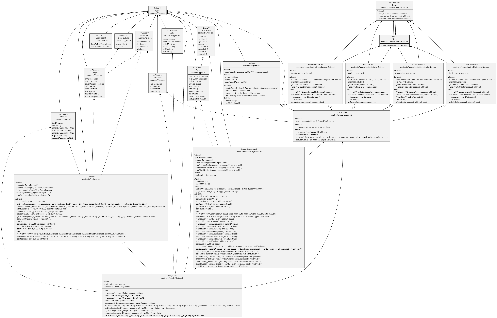

# Covid-19-ATK-Distribution-System-based-on-Blockchain

Covid-19 Antigen Test Kit Distribution System based-on Blockchain Technology

## Project Structure simplified
```
Covid-19-ATK-Distribution-System-based-on-Blockchain
├── backend
|   ├── README.md
|   ├── package.json
|   ├── .gitignore
│   ├── contracts
│   ├── Docker
│   ├── scripts
│   |   └── deploy.js
│   ├── test
│       └── test.js
└── frontend
    └── my-eth-app
        ├── README.md
        ├── package.json
        ├── .gitignore
        └── packages
            ├── contracts
            │   ├── README.md
            │   └── package.json
            └── react-app
                ├── README.md
                └── package.json
```
## UML Diagram

